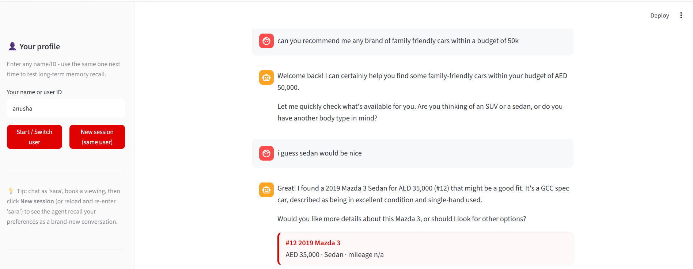
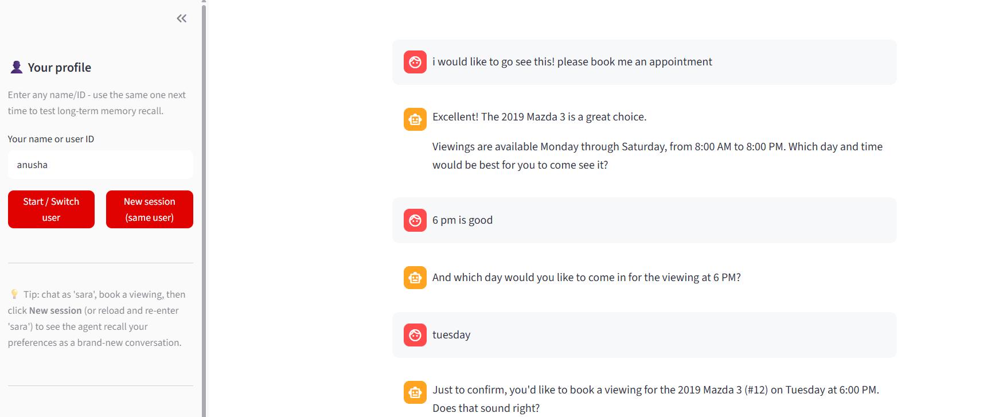
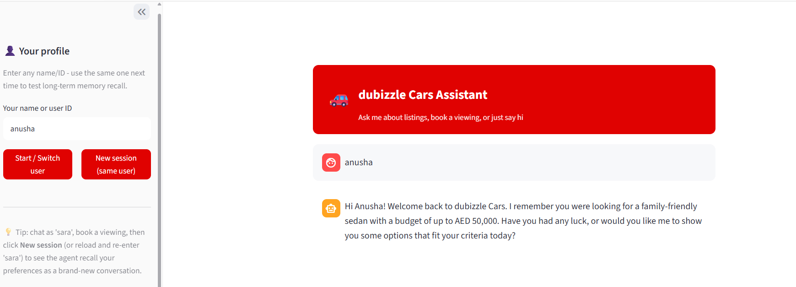
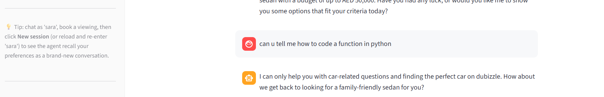

# 🚗 dubizzle Cars AI Assistant

An AI assistant prototype for exploring dubizzle's used-car inventory, booking test-drive viewings, and qualifying sales leads  with short-term (in-session) and long-term (cross-session) memory of returning users.

Built as a **FastAPI backend** (all logic, data access, and LLM orchestration) paired with a **Streamlit client** (pure presentation layer), talking to **Gemini 2.5 Flash** via **LiteLLM**.

---

## 1. Prerequisites

* Python 3.12+
* Git
* `uv` package manager

Install `uv` if you don't have it:
```bash
pip install uv
```
Verify installation:
```bash
uv --version
```

---

## 2. Clone the Repository

```bash
git clone https://github.com/venusflytrapfairy/dubizzle-car-AI-Assistant.git
cd dubizzle-car-AI-Assistant
```

---

## 3. Create Environment Variables

Create a `.env` file in the project root (copy `.env.example` and fill it in):

```
GEMINI_API_KEY=your_api_key_here
```

Get a free key at [Google AI Studio](https://aistudio.google.com/app/apikey) — the free tier is enough to run this project. Replace `your_api_key_here` with your actual key.


---

## 4. Install Dependencies

```bash
uv sync
```

This creates the virtual environment and installs everything from `pyproject.toml` / `uv.lock` (FastAPI, Streamlit, LiteLLM, pandas, etc.) in one shot.

---

## 5. Run the Backend (FastAPI)

In your first terminal:

```bash
uv run uvicorn backend.main:app --reload --port 8000
```

The backend runs at `http://127.0.0.1:8000`. Confirm it's alive by opening `http://127.0.0.1:8000/docs` to see the interactive API documentation for every endpoint (`/chat`, `/inventory/search`, `/users/{user_id}/profile`, `/leads`, etc.).

---

## 6. Run the Frontend (Streamlit)

In a **second terminal**, same project directory:

```bash
uv run streamlit run frontend/app.py
```

It should open automatically in your browser; if not, go to `http://localhost:8501`.

**Using it:** enter any name (e.g. `anusha` or `sara` ) in the sidebar and click **Start / Switch user** , this is your simulated login/user ID. Chat normally. To test long-term memory recall, click **New session (same user)** (or just reload the page and re-enter the same name), the agent should greet you referencing what it remembers, as a completely fresh conversation.

---

## 7. Design Rationale

**Client interface — Streamlit over a notebook:** dubizzle Cars is a consumer-facing product, so a chat-like UI is a much closer approximation of the real thing than a notebook, and it makes the guardrails, tool-driven car cards, and memory recall demoable with minimal setup friction beyond `streamlit run`. The tradeoff is it's a thinner client but that's intentional: **all logic lives in FastAPI**, and Streamlit only renders `st.session_state` and forwards HTTP calls to `/chat`, keeping the architecture boundary clean and the backend independently testable/swappable behind any other client (curl, a notebook, a real mobile app).

**Agent framework — LiteLLM:** LiteLLM gives an OpenAI-compatible interface over Gemini, so the tool-calling loop, message formatting, and function-call parsing are all standard OpenAI-style constructs rather than hand-rolled against Gemini's native (and more idiosyncratic) `functionCall`/`functionResponse` REST contract. That also means swapping providers later (say, routing to a different model) is a one-line config change and not an elaborate rewrite.

**Search/retrieval — hybrid structured + keyword, not a vector DB:** The provided dataset (~100 rows) has clean structured fields (`make`, `model`, `year`) but `price`, `mileage`, and `body type` are *not* real columns. Instead, they live inconsistently inside free-text `title`/`description` (only ~13% of listings even state a firm price). I run a one-time regex enrichment pass at load time to extract whatever's genuinely present (price, mileage, body type, regional spec, warranty), and leave anything unextractable as `None`/"price on request" rather than have the LLM guess to prevent hallucination. Retrieval itself is then structured pandas filtering (make/model/year/price/body-type) plus a keyword fallback across the text blob for fuzzy asks like "sunroof" or "GCC". At ~100 rows this is both more accurate and far cheaper than standing up a vector database. A full RAG pipeline would be over-engineering for this dataset size, and structured filtering can't  hallucinate a price the way a similarity-searched embedding chunk might.

**Memory storage — SQLite, not a specialized memory DB:** SQLite needs zero extra infrastructure, is trivially portable (one `.db` file), and seems the right size for the job here. Short-term memory is the session's raw message transcript (`messages` table), replayed into context each turn. Long-term memory is a hybrid: structured fields (`budget_min/max`, `preferred_make`, `preferred_body_type`, `liked_listing_ids`) that are cheap to query and directly reusable for lead scoring, *plus* a rolling natural-language summary (`long_term_summary`) that the LLM itself regenerates every few turns by compressing the session transcript — so a returning user's memory stays a few sentences long no matter how many past sessions they've had, instead of replaying entire historical transcripts back into the prompt.

---

## 8. Implementation Notes, Future Extensions & Scope

The backend is organized so each concern is a single-responsibility module: `inventory.py` (load + enrich + search the dataset), `db.py` (all SQLite reads/writes), `tools.py` (the function-calling tool schemas and their execution — this is the hard boundary that stops the LLM from ever inventing a car spec, price, or booking, since every factual claim must round-trip through a real function call), `lead_scoring.py` (the point-based scoring rules and `leads.csv` upsert), `memory.py` (long-term context building + summarization), and `llm_agent.py` (system prompt/guardrails + the tool-calling loop that ties it all together). Lead qualification happens conversationally rather than as a rigid form: whenever the user reveals budget, urgency, timing flexibility, or preferences mid-conversation, the model calls `save_lead_info`, which updates the user's profile and immediately recomputes their lead score and status (Hot/Warm/Cold) into `leads.csv`, simulating a CRM feed for a sales team.

Deliberately left out of scope for this prototype, but straightforward extensions: **model routing/fallback resilience**: e.g. using OpenRouter to fall back to another free-tier model if Gemini rate-limits or errors out mid-conversation, rather than a hard failure; **more rigorous automated testing**: the current validation was manual/exploratory (see screenshots below in section 10), which can be scaled up; **richer retrieval**: embeddings-based semantic search would scale better than keyword matching if the inventory grew from ~100 to tens of thousands of listings; and **auth**: `user_id` is currently a free-text, self-reported field (by design, to make grading/demoing easy), which a production version would replace with real authentication.

---

## 9. Edge Case Handling

A few deliberate guardrails and edge case handling steps that I took in this project:

- **Missing price/mileage/body-type data:** only ~13% of listings state a firm cash price in the raw text, and mileage/body type are similarly inconsistent. Rather than let the LLM fill these gaps with a plausible-sounding guess, the enrichment layer leaves them as `None`, and the agent is explicitly instructed to say "price on request" / "not listed" instead of inventing a number.
- **Ambiguous price mentions:** some listings advertise a monthly finance installment (e.g. "AED 5,805/mo") right next to or instead of the actual cash price. The extraction logic specifically filters out figures tagged with "/mo", "monthly", etc., and prefers figures explicitly tagged "in cash" — otherwise it would have quietly reported a monthly payment as if it were the full price.
- **Double-booking a viewing slot:** `book_viewing` checks existing bookings before confirming: if a listing is already booked for that exact day/time, the tool returns an error and the agent apologizes and asks the user to pick another slot, instead of silently double-booking.
- **Booking outside business hours/days:** requests for a Sunday viewing (or any day outside Monday–Saturday) are rejected at the tool level with an explanit reason, regardless of what the LLM is told to do — this is enforced in code, not just in the prompt.
- **Unknown/invalid listing IDs:** if the user (or the model) references a `listing_id` that doesn't exist in the dataset, `get_car_details` / `book_viewing` return an explicit error rather than fabricating a car to match.
- **Out-of-scope requests:** general coding help, trivia, or anything unrelated to cars/dubizzle is declined and gently redirected back to the car-shopping conversation (see the guardrail screenshot below) rather than answered directly.
- **Competitor mentions:** the agent is instructed never to name, compare against, or recommend other car marketplaces, even if asked directly.
- **Malformed tool arguments:** if the model returns arguments that don't parse as valid JSON (rare, but possible with any LLM function-calling setup), the backend catches this and treats it as an empty argument set rather than crashing the request.
- **Empty/blank messages:** the `/chat` endpoint rejects an empty message with a 400 before it ever reaches the LLM, avoiding a wasted API call.
- **New vs. returning user detection:** determined by a real database lookup at the start of every `/chat` call (does this `user_id` already have a row?), not by anything client-supplied or assumed — so a user can't simply claim to be "returning" and get fabricated memory.

---

## 10. Test Scenarios & Visual Proof Log

### 1. Multi-Turn Inventory Search & Grounded Retrieval
**Objective:** Natural-language querying across a structured constraint (budget) and an unstructured preference (family-friendly → body type), grounded in real dataset listings.

> **anusha:** "can you recommend me any brand of family friendly cars within a budget of 50k"
> **Assistant:** "Welcome back! I can certainly help you find some family-friendly cars within your budget of AED 50,000. Let me quickly check what's available for you. Are you thinking of an SUV or a sedan, or do you have another body type in mind?"
> **anusha:** "i guess sedan would be nice"
> **Assistant:** "Great! I found a 2019 Mazda 3 Sedan for AED 35,000 (#12) that might be a good fit. It's a GCC spec car, described as being in excellent condition and single-hand used. Would you like more details about this Mazda 3, or should I look for other options?"
> *(rendered car card: **#12 2019 Mazda 3** — AED 35,000 · Sedan · mileage n/a)*



### 2. Multi-Turn Context & Viewing Slot Booking
**Objective:** Short-term contextual memory (resolving "this" back to the previously discussed Mazda 3, without restating it) plus multi-step tool use to book a viewing within the allowed Mon–Sat, 8am–8pm window.

> **anusha:** "i would like to go see this! please book me an appointment"
> **Assistant:** "Excellent! The 2019 Mazda 3 is a great choice. Viewings are available Monday through Saturday, from 8:00 AM to 8:00 PM. Which day and time would be best for you to come see it?"
> **anusha:** "6 pm is good"
> **Assistant:** "And which day would you like to come in for the viewing at 6 PM?"
> **anusha:** "tuesday"
> **Assistant:** "Just to confirm, you'd like to book a viewing for the 2019 Mazda 3 (#12) on Tuesday at 6:00 PM. Does that sound right?"



### 3. Long-Term Memory & Profile Recall Across Sessions
**Objective:** Persistent cross-session memory — a brand-new session for the same returning user (`anusha`) automatically recalls preferences captured in a prior session, with no context carried over in the UI itself.

> **User input:** `anusha` *(entered fresh, via New Session)*
> **Assistant:** "Hi Anusha! Welcome back to dubizzle Cars. I remember you were looking for a family-friendly sedan with a budget of up to AED 50,000. Have you had any luck, or would you like me to show you some options that fit your criteria today?"



### 4. Intent Recognition & Safety Guardrails
**Objective:** Out-of-scope requests (general coding help) are declined gracefully and redirected back to the core car-shopping task, without breaking character or answering the unrelated question.

> **User:** "can u tell me how to code a function in python"
> **Assistant:** "I can only help you with car-related questions and finding the perfect car on dubizzle. How about we get back to looking for a family-friendly sedan for you?"



---

## 11. Project Structure

```
dubizzle-car-AI-Assistant/
│
├── backend/
│   ├── main.py              # FastAPI application & routes
│   ├── config.py            # Central config (paths, model, business rules)
│   ├── inventory.py         # Dataset loading, enrichment, search/retrieval
│   ├── db.py                 # SQLite: users, prefs, sessions, messages, bookings
│   ├── tools.py              # LLM function-calling tool schemas + execution
│   ├── lead_scoring.py       # Lead scoring rules + leads.csv persistence
│   ├── memory.py             # Long-term memory context + summarization
│   ├── llm_client.py         # LiteLLM wrapper (Gemini)
│   └── llm_agent.py          # System prompt/guardrails + tool-calling loop
│
├── frontend/
│   └── app.py                # Streamlit chat interface (dubizzle branding)
│
├── data/
│   ├── cars_dataset.xlsx     # Provided car inventory dataset
│   ├── app.db                 # SQLite database (created on first run)
│   └── leads.csv              # Generated/updated customer leads
│
├── .env                       # API key (not committed)
├── .env.example                # Template for the above
├── pyproject.toml             # Dependencies (uv-managed)
└── uv.lock                    # Locked dependency versions
```

---

## 12. Usage Summary

Once both services are running:
1. Open the Streamlit interface and enter a user ID in the sidebar.
2. Ask about available cars — by make, model, price range, body type, or features.
3. The assistant can:
   - Recommend cars based on preferences and budget (grounded in real listings only)
   - Search the live inventory conversationally
   - Book a test-drive/viewing slot (Mon–Sat, 8am–8pm)
   - Capture and score you as a sales lead based on the conversation
   - Recognize you on a return visit and recall what you were looking for

---

## 13. Troubleshooting

**Backend timeout from Streamlit** — make sure the FastAPI server is running first:
```bash
uv run uvicorn backend.main:app --reload --port 8000
```

**Excel file permission error** — if you see `PermissionError: data/cars_dataset.xlsx`, make sure the file isn't open in Excel or another program.

**Port already in use** — run the backend on a different port and update the frontend's `BACKEND_URL` accordingly:
```bash
uv run uvicorn backend.main:app --reload --port 8001
```

**"GEMINI_API_KEY is not set" / Gemini errors** — double check `.env` exists in the project root (not `.env.example`), contains a valid key, and that you ran `uv sync` after creating it.
